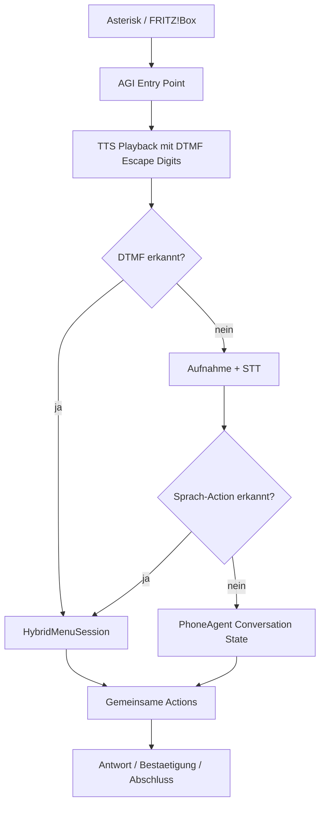

# Hybrid Phone Menu

OpenVoice AI nutzt ein hybrides Telefonmenue: DTMF-Tasten und gesprochene Intents werden auf dieselbe interne Action-Schicht gemappt.

## Architektur



## Hauptmenue

| Taste | Action | Default |
| --- | --- | --- |
| 1 | `CREATE_APPOINTMENT` | Termin vereinbaren |
| 2 | `CHANGE_APPOINTMENT` | Termin aendern |
| 3 | `CANCEL_APPOINTMENT` | Termin absagen |
| 4 | `REQUEST_CALLBACK` | Rueckruf anfordern |
| 5 | `LEAVE_MESSAGE` | Nachricht hinterlassen |
| 6 | `GET_INFORMATION` | Informationen |
| 7 | `TRANSFER_CALL` | Mitarbeiter / Weiterleitung |
| 8 | `CHANGE_LANGUAGE` | Sprache auswaehlen |
| 9 | `REPEAT_MENU` | Menue wiederholen |
| 0 | `GO_BACK` | Hilfe / Hauptmenue |
| * | `GO_BACK` | eine Ebene zurueck |
| # | `CONFIRM` | Eingabe bestaetigen |

## Terminflow

1. Taste 1 oder Sprachintent `Termin`
2. Tag per Taste oder Sprache
3. Tageszeit per Taste oder Sprache
4. Thema per Sprache
5. Telefonnummer aus Caller-ID, falls vorhanden
6. Bestaetigung per Taste 1 oder `#`

Der Termin wird erst nach expliziter Bestaetigung als bestaetigt markiert.

## DTMF-Technik

- AGI `STREAM FILE` nutzt Escape-Digits `0123456789*#`.
- Nach Playback wartet AGI kurz mit `WAIT FOR DIGIT`.
- `RECORD FILE` akzeptiert ebenfalls Escape-Digits, damit Tastendruecke waehrend einer Aufnahme verarbeitet werden.
- PJSIP Default: `dtmf_mode=rfc4733` in `asterisk/pjsip.conf.example`.

## Dashboard

Die Seite `/menu` zeigt:

- aktive Menueansage
- Tastenbelegung
- Sprachalternativen
- JSON-Konfiguration
- Validierung beim Speichern

Keine Secrets in `phone_menu.json` speichern.

## Konfiguration

Beispiel:

```bash
cp /opt/phone-agent/config/phone_menu.example.json /opt/phone-agent/config/phone_menu.json
```

Neue Calls laden die Konfiguration automatisch. Laufende Calls behalten ihren Zustand.

## Tests

Automatisiert abgedeckt:

- DTMF und Sprache teilen dieselbe Action
- ungueltige Taste
- DTMF-only-Termin bis zur Bestaetigung
- gemischter Flow aus Taste und Sprache
- kurze Hybrid-Slot-Antworten wie `Foto`, `Morgen`, `frueh`, `ja`
- gesprochene Bestaetigung nach DTMF-Terminflow
- Nachricht, Termin aendern und Termin absagen werden nach gesprochener Notiz ohne LLM beendet
- Rueckruf mit anderer gesprochener Nummer wird ohne LLM abgeschlossen
- kombinierte Spracheingaben wie `Freitag vormittags Fotoshooting` springen direkt zur Bestaetigung
- nach einer gueltigen Eingabe wird der Fehlerzaehler zurueckgesetzt, damit fruehere Vertipper keine spaeteren Fallbacks ausloesen
- Asterisk-AGI-Digit-Parsing

```bash
python -m pytest -q tests/test_hybrid_menu.py
python -m pytest -q
```

Conversation-Round-Benchmark:

```bash
PYTHONPATH=src python scripts/benchmark_conversation_flows.py --json
```

## Realer Testanruf

1. Asterisk neu laden: `asterisk -rx "core reload"`
2. DTMF-Methode pruefen: `asterisk -rx "pjsip show endpoint fritzbox-endpoint"`
3. Live-Log starten: `asterisk -rvvv`
4. Anrufen und waehrend der Ansage Taste `1` druecken.
5. Erwartung: Ansage wird unterbrochen, Terminflow startet.
6. Taste `3`, Taste `2`, Thema sprechen, Taste `1` bestaetigen.
7. Log pruefen: `dtmf_detected`, `hybrid_menu_action`, `hybrid_menu_slot_speech`.

## Timing-Messung

`scripts/analyze_call_timings.py` wertet neben STT/LLM/TTS auch DTMF aus:

- `dtmf_wait`
- `dtmf_count`
- `dtmf_events`

Damit kann ein echter Call objektiv zwischen Sprachpfad und Tastenpfad verglichen werden.
DTMF-Followup-Ansagen bekommen eindeutige Audio-Dateinamen wie `call-02-followup-1-reply.wav`,
waehrend die Timing-Auswertung beim urspruenglichen Turn bleibt.

## Einschraenkungen

- DTMF-Barge-in ist umgesetzt. Sprach-Barge-in waehrend laufender TTS-Ausgabe wird nicht erzwungen.
- Verfuegbare Kalender-Slots sind derzeit Defaults, keine echte Kalenderabfrage.
- Dashboard-Konfiguration ist JSON-basiert; ein visueller Flow-Builder ist spaeter sinnvoll.
